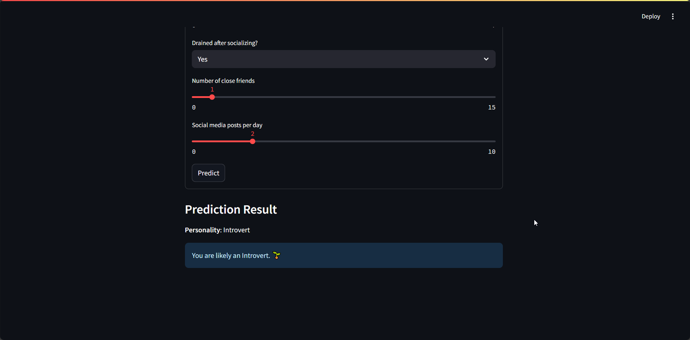

# PersonalityClassifier — Introvert vs Extrovert Predictor

A lightweight Streamlit app that predicts whether a person is likely an Introvert or Extrovert from simple daily-behavior inputs.


## Table of Contents
- **[Demo](#demo)**
- **[Features](#features)**
- **[Installation / Setup](#installation--setup)**
- **[Usage](#usage)**
- **[Configuration / Options](#configuration--options)**
- **[Contributing](#contributing)**
- **[License](#license)**
- **[Acknowledgements / Credits](#acknowledgements--credits)**

---

## Demo
Real demo assets found in `./demo/`:

- Image: `./demo/demo.png`
- Video: `./demo/demo.mp4`

Example render:



If your viewer supports video playback in Markdown, you can also preview the short clip:

```text
./demo/demo.mp4
```

---

## Features
- **Simple UI** built with `streamlit` for quick interaction.
- **Preprocessing utilities** in `utils.py` convert raw inputs to model-ready features.
- **Saved model loading** via `joblib` from `./models/model.pkl`.
- **Deterministic inference** using a binary classifier (Introvert vs Extrovert).

---

## Installation / Setup
Use a Python virtual environment for isolation.

```bash
# Create a virtual environment
python -m venv .venv

# Activate it
# On Linux/Mac:
source .venv/bin/activate
# On Windows:
.venv\Scripts\activate

# Install dependencies
pip install -r requirements.txt
```

---

## Usage
Run the Streamlit app locally:

```bash
streamlit run app.py
```

App entrypoint: `app.py`
- Loads the model using `utils.load_model("./models/model.pkl")`.
- Renders inputs and predictions using helpers in `ui.py`.

Expected project structure:
```
PersonalityClassifier/
├─ app.py
├─ ui.py
├─ utils.py
├─ models/
│  └─ model.pkl
└─ demo/
   ├─ demo.png
   └─ demo.mp4
```

---

## Configuration / Options
- **Model path**: `./models/model.pkl` (default in `app.py`). Replace the file if you want another trained model. Ensure the environment includes the libraries used to train/serialize it (e.g., `scikit-learn`).
- **Caching**: `utils.load_model` uses `@st.cache_resource` to cache the loaded model across reruns.

---

## Contributing
Contributions are welcome! Please:
- **Open an issue** to discuss proposed changes.
- **Create a PR** with a clear description, small focused commits, and screenshots for UI changes.

---

## License
This project is licensed under the **MIT License**. See the [`LICENSE`](./LICENSE) file for details.

---

## Acknowledgements / Credits
- **Streamlit** for rapid web UI development.
- **scikit-learn** and **joblib** for model training/serialization workflows.
